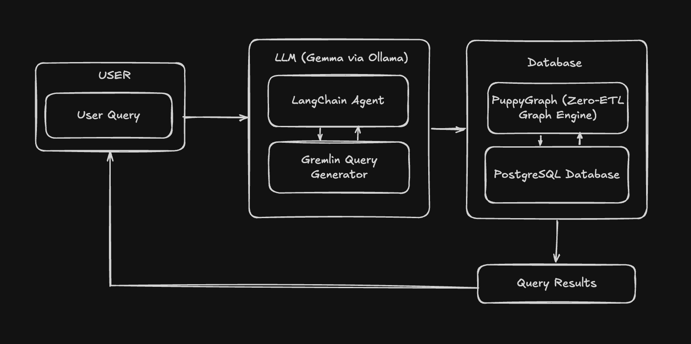

# ENA-BioGraph 🔬

An AI-powered Graph Query Agent that translates natural language questions into Gremlin graph queries to analyze Antimicrobial Resistance (AMR) sample data.

This project uses **PuppyGraph** to seamlessly map relational data stored in **PostgreSQL** into a Graph Graph, and leverages an open-source LLM (**gemma3:1b** via **Ollama**) to enable intuitive, conversational queries.

## Architecture


- **Database Layer:** PostgreSQL stores the core biological sample data, partitioned into dedicated tables (`samples`, `organisms`, `countries`, `resistances`) to ensure unique node mapping.
- **Graph Layer:** PuppyGraph acts as a Zero-ETL graph engine, querying the PostgreSQL data natively as a graph using Apache TinkerPop (Gremlin).
- **AI & Agent Layer:** LangChain and Ollama convert user utterances directly into valid Gremlin traverses (`g.V().hasLabel(...)`).
- **Package Management:** Managed blazingly fast with `uv`.

## Prerequisites

Make sure you have the following installed on your system:

- **Docker** (for running PostgreSQL and PuppyGraph)
- **Ollama** (for running the local LLM)
- **Python 3.12+** and [**uv**](https://github.com/astral-sh/uv) (for dependency management)

## Setup Instructions

### 1. Database Setup (PostgreSQL)

Start a local PostgreSQL container:

```bash
docker run --name ena-postgres -e POSTGRES_USER=postgres -e POSTGRES_PASSWORD=postgres123 -e POSTGRES_DB=ena_db -p 5432:5432 -d postgres:15
```

Seed the database with 1000 randomized samples and unique node tables:

```bash
cd ENA
uv run python database.py
```

### 2. Graph Engine Setup (PuppyGraph)

Run the PuppyGraph container:

```bash
docker run -p 8081:8081 -p 8182:8182 -d puppygraph/puppygraph:stable
```

_Note: You will need to access the PuppyGraph UI (http://localhost:8081) to configure the data catalog and map the PostgreSQL tables into graph nodes (`Sample`, `country`, `organism`, `resistance`)._

### 3. AI Setup (Ollama)

Start Ollama and pull the Gemma model:

```bash
ollama run gemma3:1b
```

## Running the Agent

With your database seeded, graph engine running, and LLM ready, start the chat interface:

```bash
uv run python main.py
```

### Example Queries

Once the CLI starts, you can ask questions in plain English:

- _"Show all samples"_
- _"Find samples from India"_
- _"Show Salmonella samples in India"_

The LLM will generate the corresponding Gremlin query (e.g., `g.V().hasLabel('Sample').has('organism','Salmonella').has('country','India').valueMap()`), validate it, execute it securely against PuppyGraph, and format the human-readable answer.

## File Overview

- `database.py`: SQLAlchemy and Pandas script to bootstrap the PostgreSQL tables and populate randomly-generated AMR data.
- `main.py`: The Langchain agent loop handling NL-to-Gremlin translation, fallback query logic, PuppyGraph websocket connection, and final answer synthesis.
- `pyproject.toml` / `requirements.txt`: Project dependencies managed by `uv`.
